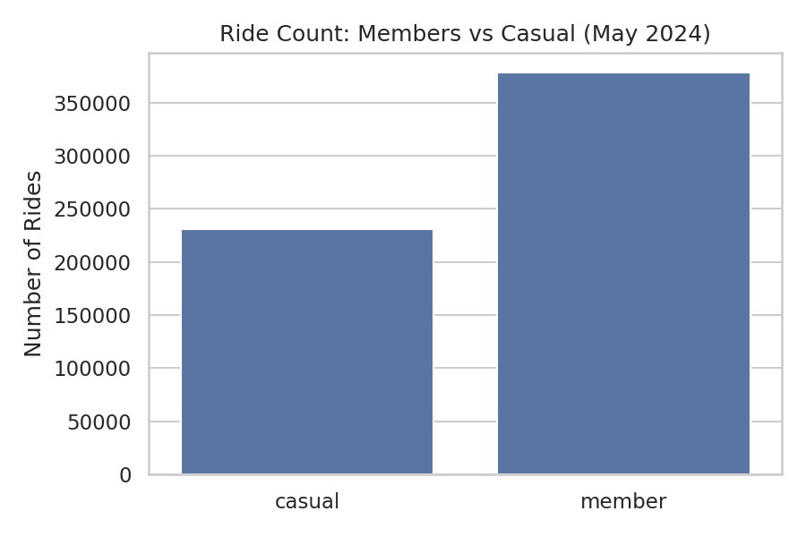
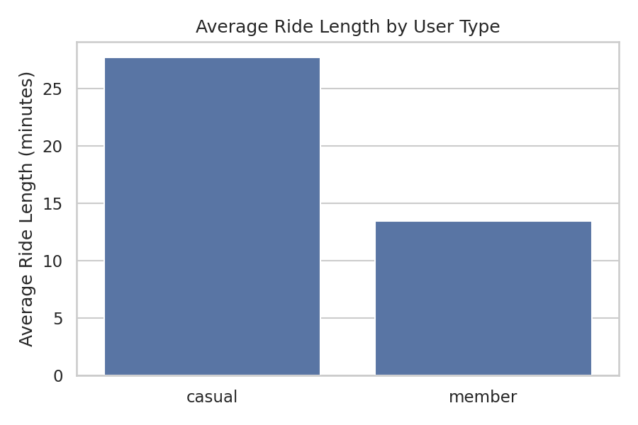
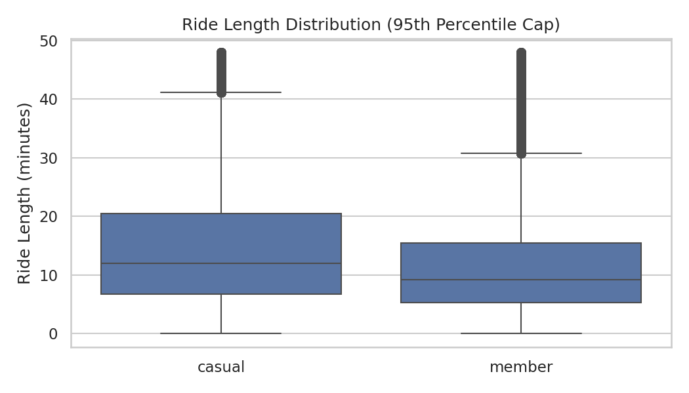
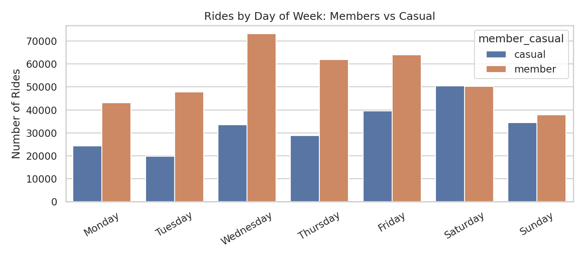
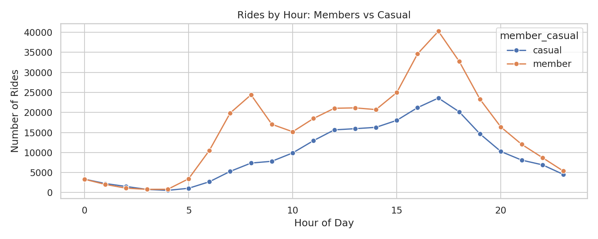
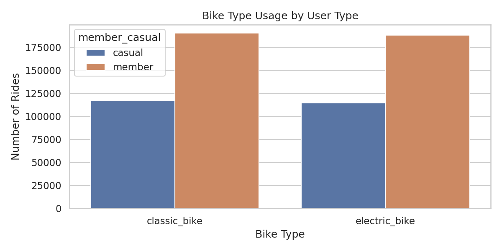

# Cyclistic Bike-Share Analysis  
**Case Study: Converting Casual Riders into Annual Members**

---

## 📌 Project Overview
This project analyses Cyclistic bike-share usage data to understand how **casual riders** differ from **annual members**, and to identify **data-driven strategies** to increase membership conversion.

The analysis follows an end-to-end data analytics workflow:
- data cleaning
- exploratory analysis
- visualization
- business recommendations

The goal is to demonstrate not only technical skills, but also **business reasoning and decision-making using data**.

---

## 🧠 Business Question
**How do casual riders and annual members use Cyclistic bikes differently, and how can these insights inform strategies to convert casual riders into members?**

---

## 📊 Dataset
- **Source:** Divvy / Cyclistic public trip data  
- **Period analysed:** May 2024  
- **Size:** ~600,000 rides  
- **Note:** Raw data files are excluded from the repository due to GitHub size limits. Cleaned data is generated via Notebook 01.

---

## 🛠 Tools & Technologies
- Python
- Pandas
- Matplotlib
- Seaborn
- Jupyter Notebooks
- Git & GitHub

---

## 📁 Project Structure
cyclistic-bike-share-analysis/
│
├── data_raw/ # Raw data (ignored in GitHub)
├── data_cleaned/ # Cleaned dataset generated via Notebook 01
├── notebooks/
│ ├── 01_load_and_clean.ipynb
│ ├── 02_member_vs_casual_analysis.ipynb
│ ├── 03_visuals_for_report.ipynb
│ └── 04_recommendations_and_next_steps.ipynb
├── visuals/ # Saved charts used in the report
├── requirements.txt
└── README.md


---

## 🔍 Analysis Workflow

### Notebook 01 — Load & Clean Data  
[`01_load_and_clean.ipynb`](notebooks/01_load_and_clean.ipynb)

- Loaded raw CSV data
- Converted date/time fields
- Created new features:
  - ride length (minutes)
  - day of week
  - hour of day
- Removed invalid or negative ride durations
- Exported a cleaned dataset for analysis

---

### Notebook 02 — Exploratory Analysis  
[`02_member_vs_casual_analysis.ipynb`](notebooks/02_member_vs_casual_analysis.ipynb)

- Compared members vs casual riders across:
  - total ride volume
  - average and median ride length
- Confirmed clear behavioural differences between rider types

---

### Notebook 03 — Visual Analysis  
[`03_visuals_for_report.ipynb`](notebooks/03_visuals_for_report.ipynb)

This notebook produces **presentation-ready charts**, saved to the `/visuals` folder.

#### Key Visuals
- **Ride Count: Members vs Casual**  
  

- **Average Ride Length by User Type**  
  

- **Ride Length Distribution (Capped at 95th Percentile)**  
  

- **Rides by Day of Week**  
  

- **Rides by Hour of Day**  
  

- **Bike Type Usage**  
  

---

### Notebook 04 — Recommendations & Next Steps  
[`04_recommendations_and_next_steps.ipynb`](notebooks/04_recommendations_and_next_steps.ipynb)

This notebook translates analytical findings into **business recommendations**, including:

- Weekend-focused membership conversion offers
- Cost-savings messaging for long-ride casual users
- Time-of-day marketing nudges
- Hypothesis-driven exploration of premium / electric bike usage

It also outlines **next analytical steps**, such as:
- expanding analysis to a full year of data
- station-level segmentation
- revenue impact modelling
- A/B testing conversion strategies

---

## 📌 Key Insights
- **Members** ride more frequently and show consistent weekday usage (commuter behaviour).
- **Casual riders** take longer rides and peak on weekends (leisure behaviour).
- Casual riders represent a strong opportunity for conversion when targeted during high-engagement periods.

---

## 🎯 Recommendations (Summary)
- Target casual riders during **weekends**, when usage is highest.
- Use **post-ride cost comparisons** to highlight membership savings.
- Test **time-based nudges** aligned with leisure usage patterns.
- Explore premium membership options as a hypothesis, not a conclusion.

---

## ▶ How to Run This Project
1. Clone the repository
2. Install dependencies:
   ```bash
   pip install -r requirements.txt

Run notebooks in order:

01_load_and_clean.ipynb

02_member_vs_casual_analysis.ipynb

03_visuals_for_report.ipynb

04_recommendations_and_next_steps.ipynb